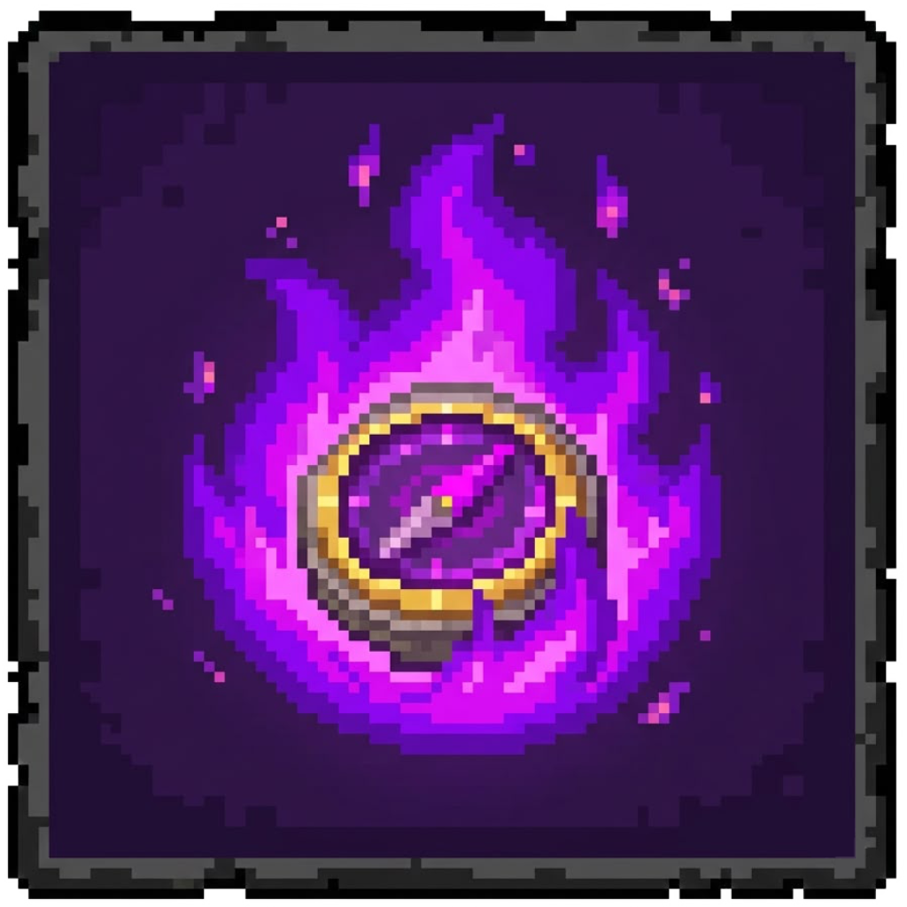

# Lodestone Teleporter

Lodestone Teleporter is a Minecraft Bedrock behavior pack that lets players bind compasses to lodestones and teleport back to those exact locations.

## What It Does

- Tune a compass by using it on a lodestone.
- Store target coordinates directly on the compass item.
- Teleport by crouching three times quickly while holding a tuned compass.
- Support multiple tuned compasses, each with its own destination.
- Work across dimensions using the location stored on each item.

## How It Works In Game

1. Hold a compass.
2. Right-click (or interact) on a lodestone to tune it.
3. Hold that tuned compass.
4. Sneak three times within a short interval to teleport.

## Notes

- Tuned compasses are tagged with unique lore data so each compass keeps its own link.
- Teleport effects include sound, particles, and a server broadcast message.

## Files

- `scripts/main.js`: Core gameplay logic.
- `manifest.json`: Pack metadata and script dependency info.
- `pack_icon.png`: Add-on icon used in-game and in this README.
